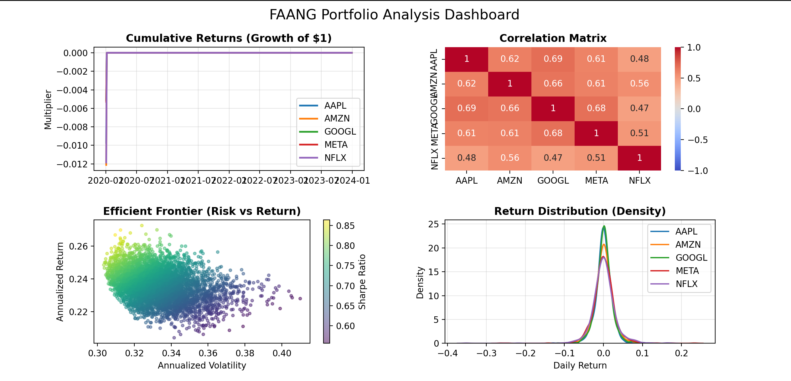

# 📈 Stock Portfolio Optimizer
**A Python-based financial analysis tool that constructs an optimal investment portfolio using Modern Portfolio Theory.**

# PROJECT OVERVIEW
This project analyzes data of stocks in the provided dataset (Facebook/Meta, Apple, Amazon, Netflix, Google), providing you with insights to help you determine the best trade-off between risk and return. I separated backend calculations(logic) from the frontend visualization to avoid confusion and also for better presentation.

##  How to Run This Project

### Step 1: Set up the Environment
I used Python 3.11.14 to ensure compatibility with financial libraries. Open your terminal (or Anaconda Prompt) and run the following before you run the file to ensure your code runs well:

# Create the specific environment
conda create -n finance python=3.11.14

# Activate the environment (Enter the sandbox)
conda activate finance

# Replace the "FAANG dataset- finance.csv" file with your own dataset. 
Ensure your dataset follows the structure of the: FAANG dataset- finance.csv" file, which is as follows (following this order of headers):
Date(in ISO format), Nams of each stock, for example:
"Date","AAPL","AMZN","GOOGL","META","NFLX"

# Change the path in faang_calculations.py
Go to line 12. You'd see this:
'''
faang_data = pd.read_csv('FAANG dataset- finance.csv')
'''
Replace the "FAANG dataset- finance.csv" with your own csv name. Ensure the name of the file is placed in the quotation marks to prevent errors.

### Step 2: Install Dependencies

Install the required libraries inside your new environment:

pip install pandas numpy matplotlib seaborn PyPortfolioOpt

### Step 3: Run the Dashboard

To generate the visual report, run the plotting script:

python faang_plots.py

## The Tech Stack (And Why I Used It)

This project was built using **Miniconda** (Environment: `finance`, Python 3.11.14).

### Why did i use  Miniconda?
**Isolation:** Miniconda creates a "Sandbox" (Virtual Environment) specifically for this project.
* **Dependency Management:** It ensures that the specific libraries needed for Finance don't conflict with other projects or system-wide settings.
* **Reproducibility:** It guarantees that anyone can download this repository and run the code exactly as I did, without version errors , this is very important because i ran into many errors whilst trying to analyse the dataset, it is quite hard to get this particular library without Miniconda(* **PyPortfolioOpt:**).

### Key Libraries used
* **Pandas:** The "Excel on steroids." Used to clean and organize the raw CSV data.
* **NumPy:** Handles the heavy mathematical calculations(matrix algebra) for risk calculations.
* **PyPortfolioOpt:** A specialized financial library used to calculate the "Efficient Frontier" and optimization algorithms. You really need this library because it is the most important library for portfolio optimization, my opinon of course.

* **Matplotlib & Seaborn:** Used to visualize the data into a 4-chart dashboard.

##  Project Structure

I separated the project into two distinct scripts to keep the code flexible, clear and clean:

* **'faang_calculations.py' (The Brain behind the plot):**
    * Loads the raw data.
    * Calculates Annual Returns, Volatility, and Covariance.
    * *Note:* This file contains the logic. If you run it directly, it prints the raw statistics and not the visuals.

* **'faang_plots.py' (The visuals):**
    * Imports the calculated variables from The Brain.
    * Generates a 4-part dashboard (Cumulative Returns, Correlation Matrix, Efficient Frontier, Return Distribution).
    * **Run this file to see the final visualization.**

##  Key Insights & Features

  * **Risk Management:** Calculated the Annualized Volatility to understand the "up and down movement" of each stock.
  * **Diversification:** Used a Correlation Matrix to see how closely the tech stocks move together (Sector Risk).
  * **Optimization:** Utilized Monte Carlo Simulations to find the "Max Sharpe Ratio" portfolio (the highest return for the lowest risk).

## Example
The repo comes with a FAANG dataset example that showcases the dashboard you can expect from the program. 

You recieve this as the result on the plots:

In addition, you get some nice tables in the output, on the terminal.
<!-- end list -->
